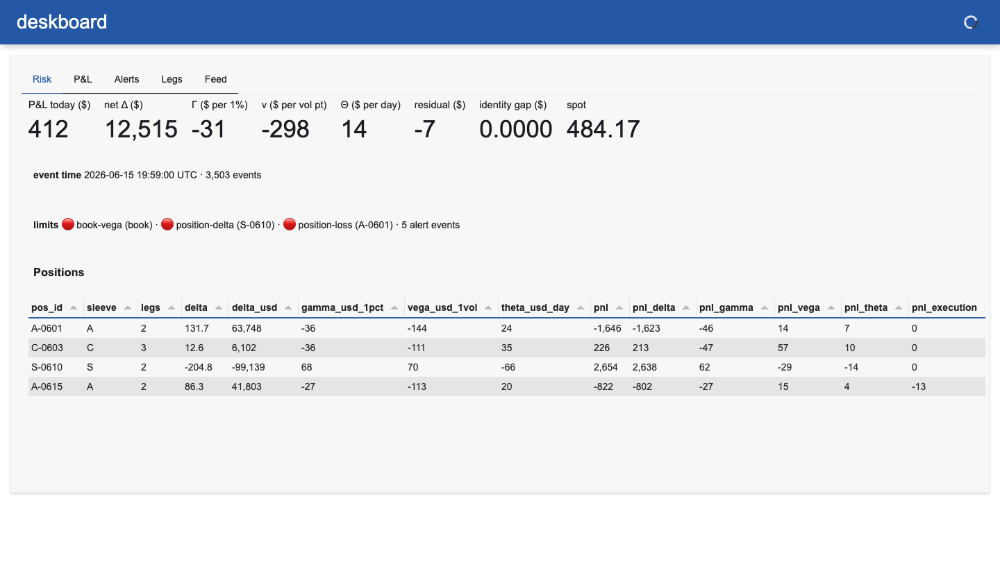
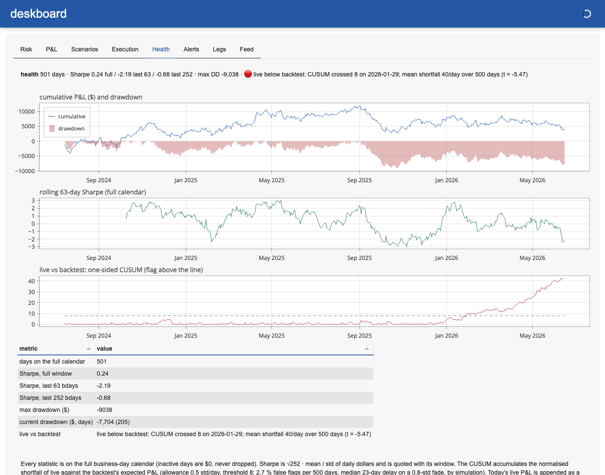

# deskboard

[](https://github.com/charlieyanhx/deskboard/actions/workflows/ci.yml)


An options risk and P&L dashboard driven by an event bus, with a **deterministic replay
mode**: Black-Scholes Greeks and dollar-Greeks per leg, P&L attribution with an exact
identity, a limit engine that says *why* it fired, a Telegram bot that pushes those alerts
and answers `/risk` `/pnl` `/positions` `/alerts`, a strategy-health page (full-calendar
Sharpe, drawdown, a CUSUM on live-vs-backtest), and a Panel UI that only reads engine
state. Same session file → same book state, to 1e-6, on any machine — that is the test.



*Risk page at the close of the demo session (16:00 New York): +$412 for the day, four
positions, `book-vega`, `position-delta` and `position-loss` in breach, identity gap 0.0000.*

```
quotes / fills / positions ─► bus ─► Book (Greeks, $-Greeks, attribution) ─► snapshot ─► UI · Telegram
        ▲                             │                                          ▲
   replay file (N× speed)             └─► LimitEngine ── alert events ───────────┘
   live connector: v0.3                   (state change only, with a reason)
```

**What "real-time" means here.** Every event is dispatched synchronously to the book and
the limit engine on the server's asyncio loop (p99 dispatch 2–5 ms on an M-series
laptop; the budget is 10 ms and a test enforces it); the UI and the bot read the
resulting snapshot. There is no live market-data connector yet — replay is the only feed,
and it publishes the same event shape a connector would, so nothing downstream changes
when one lands.

## Run it

```bash
pip install -e ".[dev]"
pytest -q                  # 46 tests: closed-form values (incl. Hull's example), parity, finite differences, bus order, replay
                           #   determinism, attribution identity (incl. fills and quotes without
                           #   Greeks), latency budget, limit hysteresis, Telegram bot with a fake API,
                           #   full-calendar Sharpe, drawdown identities, CUSUM false-flag rate by simulation
deskboard record           # regenerate the demo session (3,503 events) and the 500-day P&L history — seeded, byte-identical
deskboard replay           # headless: totals, alerts, bus latency, state hash
deskboard health           # strategy health from data/demo/pnl_history.csv (or --history yours.csv)
deskboard serve --speed 60 # http://localhost:5006 — one trading day in ~7 minutes; ?tab=Health opens on a page
```

`deskboard replay` on the committed demo session prints exactly this (M-series laptop; the
latency line varies run to run, nothing else does):

```
events 3503  positions 4  spot SYN 484.17
pnl 411.70 = delta 426.68 + gamma -58.29 + vega 56.61 + theta 7.10 + execution -13.50 + residual -6.90   identity_gap 0.0000
greeks  delta$ 12515  gamma$/1% -31  vega$/vol -298  theta$/day 14
alert BREACH  book-vega        book     ν$ per vol pt -265 < limit -250
alert CLEARED book-vega        book     ν$ per vol pt back to -237, inside limit -250
alert BREACH  book-vega        book     ν$ per vol pt -346 < limit -250
alert BREACH  position-loss    A-0601   P&L today -1,228 < limit -1,200
alert BREACH  position-delta   S-0610   net Δ$ -90,334 < limit -90,000
ladder  worst -10,928 at spot +10% vol +10%  |  spot -5%: -1,548  spot +5%: -845  vol +5: -1,442
execution  2 fills  cost vs mid $13.50  mean 1.00 of half-spread
bus latency ms  p50 0.85  p99 5.35  max 53.80  n 3508
state hash af26af790829676d3824c15cef4989c04448f5e65e6b1237358c802abf2ac3ca
```

Read it as a trader would. The day is +$412: delta +$427 (the book was net short Δ$ −51k
in the morning and finished +12.5k after `A-0615` came on at 11:00 and spot fell 3 %),
short-gamma bleed −$58, vega **+$57 while short vega** — on this surface the strike vols of
the short puts fell as spot moved toward them (skew), which outweighed the post-lunch level
bump; the Legs page shows it per leg — theta +$7, the spread paid opening `A-0615` (−$13.50,
the execution line), and −$6.90 the Greeks do not explain, shown as its own line. The ladder
line says where the book is exposed *now*: worst is a +10 % rally with vol up 10 points
(−$10.9k) — the short calls in `C-0603` and `S-0610`, not the puts the P&L came from.

### Telegram

The bot is read-only, answers only the chat you configure, and talks to the Bot API over
HTTPS directly (httpx, long-polling) — no framework, no webhook, no token in the repo.

1. **Create the bot.** In Telegram, message `@BotFather`, send `/newbot`, pick a name and a
   username ending in `bot`. Copy the token — it looks like `123456789:AAF…` (the digits,
   the colon and the letters are all part of it).
2. **Open the chat.** Private chat: open your new bot and press **Start** (Telegram refuses
   to let a bot message a user who has never messaged it). Group: add the bot to the group
   and send `/start` there. Group ids are negative; supergroups start with `-100`.
3. **Find the chat id** (numeric only — an `@username` sends but never matches inbound):
   ```bash
   export TELEGRAM_BOT_TOKEN=123456789:AAF...
   curl -s "https://api.telegram.org/bot$TELEGRAM_BOT_TOKEN/getUpdates" | python -m json.tool | grep -A3 '"chat"'
   ```
   Copy `"id"` from the chat block (empty result → nobody has messaged the bot yet; go back
   to step 2). Private chats can also use `@userinfobot`.
4. **Test, then serve.**
   ```bash
   export TELEGRAM_CHAT_ID=123456789
   deskboard telegram-test        # prints: bot @yourbot ok; sending to chat …  /  sent — check Telegram
   deskboard serve --telegram     # prints: telegram: pushing alerts to chat … ; then the dashboard URL
   ```
   In Telegram you get "deskboard online ✅" and the risk card. The feed and the bot run in
   the server process — no browser tab needs to be open, and opening several tabs does not
   duplicate alerts. One `--telegram` process per bot token (Telegram allows one poller).

If it fails, the message says which variable to look at, with Telegram's own description
and the token redacted:

| you see | it means |
|---|---|
| `401 Unauthorized — token wrong` | `TELEGRAM_BOT_TOKEN` is wrong |
| `404 Not Found — token malformed` | the token lost its `123456789:` prefix in a copy-paste |
| `400 Bad Request: chat not found — chat id wrong, or the bot is not in that group` | `TELEGRAM_CHAT_ID` is wrong, or the bot was never added to the group |
| `403 Forbidden: bot can't initiate conversation with a user — press Start` | step 2 was skipped |
| `409 Conflict — another process is polling this token` | a second `deskboard serve --telegram` (or another bot) is running |

While serving, a Telegram outage never stops the book: failed pushes are counted on the
Feed page and logged, and the poller retries with back-off. Messages sent to the bot while
it was down are skipped rather than answered late. Each limit event is one message —
🔴 BREACH with the value and the bound, 🟢 CLEARED once the value is 5 % back inside
(hysteresis, so a number hovering at a limit does not page you every tick).

`deskboard health` on the committed demo history (500 business days, `date,pnl,backtest`;
the live series tracks the backtest, then falls $120/day short for the last 120 days):

```
days on the full calendar    500
Sharpe, full window          0.22
Sharpe, last 63 bdays        -2.41
Sharpe, last 252 bdays       -0.63
max drawdown ($)             -9038
current drawdown ($, days)   -8,115 (204)
live vs backtest             live below backtest: CUSUM crossed 8 on 2026-01-29; mean shortfall 40/day over 500 days (t = -5.47)
```



*Health page at the close of the demo session. The fade starts on 29 December; the CUSUM
crosses 8 on 29 January, 23 business days later — the median delay the threshold was chosen
for. The rolling 63-day Sharpe read +0.99 that day and was still positive on some days in
late May: a window statistic cannot separate a fade from noise this early, which is the
CUSUM's job.*

## What it shows

| Page | Content |
|---|---|
| **Risk** | P&L today, net Δ$, Γ$ per 1 %, ν$ per vol point, Θ$ per day, residual, identity gap (must read 0.0000), spot; open limit breaches; positions table with per-position Greeks and attribution |
| **P&L** | attribution bars: delta / gamma / vega / theta / execution / residual |
| **Execution** | every fill against the mid at the moment it printed — $ per contract and fraction of the half-spread paid (tcakit's units); the sum is the `execution` line of the attribution |
| **Health** | the P&L history plus today as a provisional last day: cumulative P&L and drawdown, rolling 63-day Sharpe on the full calendar, one-sided CUSUM of live against the backtest's expected P&L with the date it crossed |
| **Scenarios** | spot × vol ladder: full Black-Scholes revaluation of every leg at the current marks, P&L per cell, worst cell named; the zero cell is 0 by construction and the ±1 % cells reproduce Δ$ and Γ$ (tested) |
| **Alerts** | the rules, and every BREACH / CLEARED event with its reason |
| **Legs** | per-contract mid, implied vol, Greeks, P&L |
| **Feed** | replay progress, bus dispatch latency p50 / p99 / max, Telegram sent / failed |

Numbers, and a reason for each number. No AI-insight widgets.

## Design rules

Tested:

- **Determinism** — replaying the same file gives the same `Book.state_hash()` at any speed; CI regenerates the demo session on Linux, checks it row-for-row against the committed parquet (not byte-for-byte: the parquet footer embeds the pandas and pyarrow versions) and checks the committed hash. The hash rounds to 1e-6 because raw Greeks differ across platforms in the last bits (`norm.cdf`, Brent) — measured on the first CI run, see [docs/DESIGN.md](docs/DESIGN.md).
- **Attribution identity** — `realized == delta + gamma + vega + theta + execution + residual` to 1e-9 for every position, including a fill on an already-marked leg and a quote with no valid implied vol (that move lands in `residual`, never nowhere).
- **Latency budget** — bus dispatch p99 < 10 ms, measured every run.
- **Alerts on state change only**, each with the value and the bound; hysteresis on clear; a rule set never changes the state hash.
- **Bot failures are non-fatal** — a raising Telegram API inside the bus chain does not stop the replay.
- **Health on the full calendar** — a strategy that trades one day in five cannot report the Sharpe of its active days (padding with $0 cuts it by ~√5, tested); the CUSUM threshold is 8, not the textbook 5, because on 500 simulated business days of noise 5 flags 41 % of clean histories and 8 flags 2.7 % (tested by simulation), at a median 23-day delay on a 0.8-std/day fade.

By construction (not a test): the pricer is an interface (`price`, `greeks`, `implied_vol`)
so a surface pricer can replace Black-Scholes without touching attribution; the code
contains no order-submission path — positions come from a blotter file (`--blotter`), the
demo one or a live bot's state file with the same `{positions: [{pos_id, legs: [...]}]}` shape.

## What is where

```
src/deskboard/
  bus.py              asyncio bus; ordered dispatch; per-event latency, p50/p99/max
  engine/greeks.py    BSM price / Greeks / implied vol (Brent)
  engine/book.py      positions, marks, dollar-Greeks, attribution, snapshot, state hash
  engine/limits.py    rules → alert events with reasons; hysteresis
  engine/scenarios.py spot × vol ladder by full revaluation; zero cell exact; missing marks named
  engine/health.py    full-calendar Sharpe (rolling), drawdown, live-vs-backtest CUSUM; load_history
  engine/desk.py      composition root: bus + book + limits
  alerts/telegram.py  Bot API over httpx: push alerts, answer commands, allow-listed chat
  feeds/replay.py     parquet/CSV → bus at N× speed
  feeds/synth.py      seeded demo session recorder, demo blotter, demo P&L history
  feeds/blotter.py    positions from a file (demo or live-state shape)
  ui/app.py           Panel app: Risk / P&L / Scenarios / Execution / Health / Alerts / Legs / Feed; one desk per process
  cli.py              record · replay · serve · health · telegram-test
data/demo/            session parquet, blotter.json, pnl_history.csv, STATE_HASH
docs/DESIGN.md        the one rule, the cross-platform finding, the CUSUM threshold, what is not done yet
```

## Roadmap

v0.3 still open: one live underlying feed, a recorded demo. v0.4: textual TUI, Grafana export.

## Data and privacy

Everything in this repo is synthetic: the demo session is generated by `deskboard record`
from a seeded vol surface, the demo blotter is fictional, and the 500-day P&L history is
drawn from a seeded normal with a fade written into its last 120 days. The author's live
positions, P&L history and broker connector configuration never enter the repo; a live book
runs through the same blotter schema and history CSV from local, gitignored files.

## Companion repos

[pricers](https://github.com/charlieyanhx/pricers) — option pricers validated against closed forms and QuantLib ·
[riskkit](https://github.com/charlieyanhx/riskkit) — VaR/ES, backtests with known size and power, SPAN margin ·
[volsurf](https://github.com/charlieyanhx/volsurf) — implied-vol surfaces from option chains with static-arbitrage
checks reported, not repaired ·
[quotesim](https://github.com/charlieyanhx/quotesim) — options quoting simulator with synthetic flow and an exact
P&L attribution ·
[tcakit](https://github.com/charlieyanhx/tcakit) — transaction cost analysis and market
impact ·
[quant-research-agent](https://github.com/charlieyanhx/quant-research-agent) — a backtest
review agent and the evals that measure it ·
[tickq](https://github.com/charlieyanhx/tickq) — DuckDB market-data SQL: partitioned Parquet lake, ASOF
joins with the tie rule stated, quality checks with recall and precision ·
[lobcore](https://github.com/charlieyanhx/lobcore) — bounded-array limit order book in Rust with a
reference-book differential test, ITCH 5.0 replay and PyO3 bindings ·
[exhibitkit](https://github.com/charlieyanhx/exhibitkit) — sell-side research documents from Markdown, exhibits
with mandatory source lines ·
[claimkeeper](https://github.com/charlieyanhx/claimkeeper) — a ledger that scores a note's falsifiable claims
right or wrong once their dates arrive.

MIT © Hanxiong (Charlie) Yan
